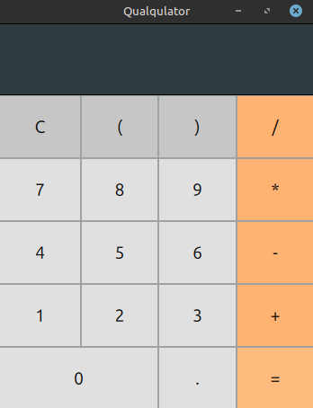

    <h1>Qualqulator</h1>
    
    
This project implements a modern calculator with a clean UI built from custom elements. It uses a Pratt parsing algorithm for expression evaluation, ensuring correct operator precedence and making the system easily extensible. The combination of modular UI and robust parsing highlights both usability and solid software design.

